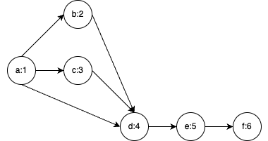
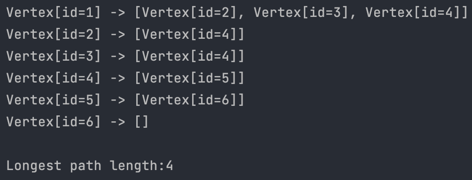

# longest-path-dag

## Implementation Details

### 1. DAG Check – `isDAG()`
- Before performing the longest path calculation, I ensure that the graph is acyclic, which is required for using the topological sort.
- This method uses DFS to detect cycles.

### 2. Topological Sort – `topologicalSort()`
- Once it is confirmed that the given graph is a DAG, I perform topological sort of vertices on the graph.
- This is necessary to calculate the longest path as I need to arrange the vertices in an order such that each vertex is placed before its successive vertices.
- This order ensures that when the longest path to a vertex is calculated, all possible paths to it are considered.
- Topological sort is done using DFS. Each vertex is pushed into a stack once all its adjacent vertices are processed, ensuring it appears before its neighboring vertices.

### 3. Calculate Longest Path – `findLongestPathfromVertex()`
- The longest path is computed after the vertices are sorted. A HashMap is initialized to store the distances such that every vertex has a distance of Integer.MIN_VALUE(indicating unreachability) except the start vertex, which is 0 as it is the start of the path.
- For each vertex in the sorted order, I update the distance of its adjacent vertices starting from the start vertex.
- If the current distance to an adjacent vertex is less than the distance to the current vertex plus one, I update the distance to the adjacent vertex.
- This way, the longest path to each vertex is found based on the previously computed longest path to predecessors.
- The longest path is the maximum value in the HashMap.

## Important Classes

### `Vertex` (Record):
- This is a record type with a unique ID field for each vertex. Records are used as they are immutable and reduces boilerplate code for standard required methods.

### `GraphCore`:
- This is the base graph class to manage the graph structure. It maintains an adjacency list to represent the graph and has methods for adding vertices and edges and getting adjacent vertices of a given vertex.

### `GraphOperations`:
- This class extends the base graph class and has all the methods mentioned in the implementation details section.

### `DagExample`:
- This is a utility class with a static method to create a graph and find the longest path from a given vertex. This could also have been done through a test class.
- Example graph used to test the implementation:

  

- Console output of the computation:

  

## Questions

### 1. Does the solution work for larger graphs?
- Yes, the solution works for larger graphs as I use topological sorting with dynamic programming to efficiently calculate the longest path. For graphs with long chains and fully connected graphs, there can be degradation in performance as the stack can get big, and distances must be updated for all the adjacent vertices.

### 2. Can you think of any optimizations?
- Parallel processing can improve performance, although topological sorting is inherently sequential. All the distances to adjacent vertices can be calculated and updated in parallel using concurrent collections and parallelstreams functionality.
- If the longest path from a particular vertex is a common query, then this result can be cached to improve the performance and avoid re-computation of results. This makes sense in the IPAC questionnaire scenario, where the questionnaire would stay the same.

### 3. What’s the computational complexity of your solution?
- Topological Sorting requires visiting every edge and vertex once – `O(V+E)`
- The longest path Calculation requires the vertex and edge to be processed once while calculating distance – `O(V+E)`
- Checking if the graph is cyclic also requires each vertex and edge to be visited once – `O(V+E)`
- Hence, the overall complexity is linear.

### 4. Are there any unusual cases that aren’t handled?
- The computation handles the usual edge cases of empty graphs and unconnected/isolated vertices.
- The creation of graphs is currently a bit clunky and is difficult for large graphs. This could be improved by defining the edges and vertices in a file and then utilizing and parsing this file to initialize the graph.

## Additional Questions

### 5. What are some things you don’t like about Java?
- This question is hard to answer as I love working with Java.
- Sometimes, verbosity could be of concern while working with Java, but some of these have been tackled in recent versions. Using popular frameworks like Spring/SpringBoot has also helped reduce verbosity.
- Memory management in Java is abstracted from the user, which is possibly a good thing as it reduces some overhead, but tuning GC for low-latency applications can sometimes be a little complex.

### 6. If you could choose any language/framework/technology stack, what would you choose and why?
- I would choose Java as my language, along with SpringBoot framework for the backend and either React or Angular as the front end (if required).
- Java with SpringBoot simplifies implementation through a rich ecosystem of libraries that offers solutions varying from security to performance.
- React/Angular provides component-based modular architecture for building UI, which is easy to develop and maintain.
- Both these technologies are mature, have huge community support, and are open source.
- Also, powerful development tools exist for these technologies.

## Resources

I found this [Graph Theory Playlist](https://www.youtube.com/watch?v=DgXR2OWQnLc&list=PLDV1Zeh2NRsDGO4--qE8yH72HFL1Km93P&ab_channel=WilliamFiset) helpful.
